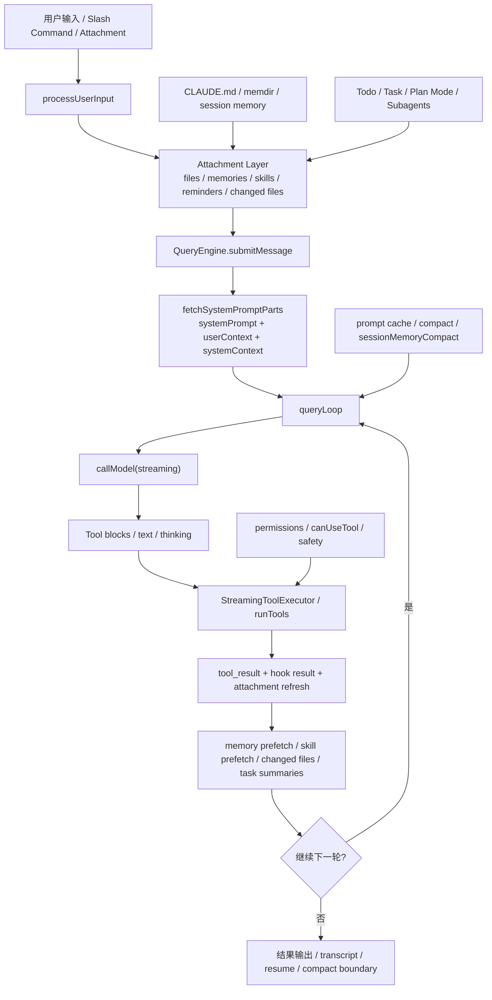

# Claude Code 智能体架构与竞争力地图

这篇文档是整套分析文档的总纲，目标只有一个：先把 `claude-code-cli` 里最核心、最有竞争力的设计抓出来，再把每个主题分流到对应详解文档。它不是按目录树介绍功能，而是按“智能体 runtime 的关键能力”来拆。

如果只先记一句话，可以记这一句：

> Claude Code 的优势不在于某一条 prompt，而在于它把输入路由、记忆分层、计划状态、agent loop、tool runtime、prompt cache、仓库世界模型和权限治理做成了一套协同工作的执行内核。

## 一、和外界很多 agent 最不一样的点

### 1. 意图识别不是分类器，而是路由管线

它没有先做一个“intent classification”，再去匹配模板；而是把输入拆成：

- 输入规范化
- slash command 解析
- 附件抽取
- 技能发现
- 工具搜索
- 模式切换
- 代理提及和代理分发

换句话说，它不是问“用户的意图标签是什么”，而是在问“这条输入该被送入哪条执行管线”。这比单一分类器更稳，也更容易演进。详见 [01-意图识别与输入路由](./01-意图识别与输入路由.md) 与 [11-代码细读-意图识别与输入编排](./11-代码细读-意图识别与输入编排.md)。

### 2. 记忆不是单一 memory，而是多层上下文治理

它把“记忆”拆成了几种完全不同的持久化与上下文机制：

- `CLAUDE.md`：静态项目级约束和协作偏好
- `MEMORY.md` / memdir：长期、可索引、文件化记忆
- relevant memory surfacing：按当前 prompt 自动检索相关记忆
- session memory：会话工作记忆，周期性后台抽取
- transcript / session storage：会话恢复与 resume
- read file cache：文件已读状态、mtime、partial view、changed files 检测

所以它的“记忆力”不是把整个聊天历史塞回去，而是把不同生命周期、不同可信度、不同用途的信息拆开治理。详见 [02-记忆系统与上下文治理](./02-记忆系统与上下文治理.md) 与 [12-代码细读-记忆系统与上下文治理](./12-代码细读-记忆系统与上下文治理.md)。

### 3. 规划不是“先想想”，而是运行时状态机

外界很多 agent 把 planning 停留在一段提示词或 CoT 风格自述。这里不是。这里的规划被落实为：

- `EnterPlanMode`
- `ExitPlanMode`
- plan file
- `TodoWrite`
- `TaskCreate` / `TaskUpdate`
- Plan agent / Explore agent
- 后台 subagent 与通知回路

这意味着“计划”不是模型嘴上承诺，而是可进入、可退出、可审批、可持久化、可和任务系统联动的运行时状态。详见 [03-规划、任务与代理协作](./03-规划-任务-代理协作.md) 与 [13-代码细读-规划-任务-代理协作](./13-代码细读-规划-任务-代理协作.md)。

### 4. agent loop 是显式执行内核，不是隐式聊天

这套系统真正的核心不在 UI，而在 `QueryEngine.ts` 和 `query.ts`：

- `QueryEngine.submitMessage()` 负责组装一轮 query 的上下文前缀
- `queryLoop()` 负责执行模型调用、工具执行、错误恢复、compact、继续回合
- `StreamingToolExecutor` 负责边流边跑工具
- `runTools()` 负责并发安全工具批处理

所以它不是“用户说一句，模型回一句”的聊天壳子，而是一套带恢复逻辑、工具编排、缓存优化、上下文压缩和后台预取的执行循环。详见 [23-核心AgentLoop详解.md](./23-核心AgentLoop详解.md)。

### 5. Harness Engineering 是一等公民

这套代码最值得其他 AI 系统学习的，不是 prompt 本身，而是 prompt 之外那层“支架工程”：

- system prompt 被切成静态前缀和动态尾部
- 动态信息尽量迁移到 attachment lane，避免 prompt cache 失效
- fork subagent 会复用 cache-safe prefix
- tool result 会做 budget 和持久化裁剪
- 会用 session memory 替代纯对话摘要
- prompt cache 失效原因会被显式检测和归因

也就是说，它在设计 prompt 的同时，设计了 prompt 的生命周期、缓存边界、动态注入策略和恢复策略。详见 [08-Harness-Engineering-与提示词工程](./08-Harness-Engineering-与提示词工程.md)。

### 6. 写代码依赖仓库世界模型，而不是窗口内补全

Claude Code 能全局写码，不是因为模型 magically 更聪明，而是 runtime 在持续维护一个“仓库世界模型”：

- git status 快照
- 已读文件缓存
- changed files 检测
- nested memory / dynamic skills
- plan / todo / task 状态
- MCP / tool / agent 列表变化
- subagent 共享的 cache-safe 上下文

这让它写代码时依赖的是整个工作现场，而不是当前窗口里最后几百行文本。详见 [04-全局写码与仓库感知执行](./04-全局写码与仓库感知执行.md) 与 [14-代码细读-全局写码与执行闭环](./14-代码细读-全局写码与执行闭环.md)。

## 二、整体架构图



## 三、最关键的源码地图

| 主题 | 关键文件 | 作用 | 为什么关键 |
| --- | --- | --- | --- |
| 输入路由 | `utils/processUserInput/processUserInput.ts` | 统一处理 prompt、slash command、附件、图片、hook | 决定一条输入进入哪条执行管线 |
| 动态附件 | `utils/attachments.ts` | 注入 memories、changed files、agent list、todo、plan reminders 等 | 把动态运行态搬出 system prompt，降低 cache bust |
| 会话前缀组装 | `QueryEngine.ts` / `utils/queryContext.ts` | 组装 system prompt、user context、system context、transcript | 把“一轮执行”需要的上下文拼好 |
| 主循环 | `query.ts` | 模型调用、工具执行、恢复、compact、继续轮转 | 真正的 agent kernel |
| 工具编排 | `services/tools/toolOrchestration.ts` / `services/tools/StreamingToolExecutor.ts` | 并发安全批处理、边流边执行、出错传播 | 保证工具执行快且不乱 |
| 记忆 | `context.ts` / `memdir/memdir.ts` / `services/SessionMemory/*` | 静态记忆、长期记忆、会话记忆 | 区分长期知识、当前任务状态、文件真实状态 |
| 规划 | `tools/EnterPlanModeTool/*` / `tools/ExitPlanModeTool/*` / `tools/TodoWriteTool/*` | 计划模式、todo、审批流 | 把 planning 做成一等运行时 |
| 子代理 | `tools/AgentTool/*` / `utils/forkedAgent.ts` | subagent、fork agent、背景代理、worktree 隔离 | 实现并行、隔离、缓存复用 |
| Prompt cache | `constants/prompts.ts` / `constants/systemPromptSections.ts` / `services/api/promptCacheBreakDetection.ts` | 静态前缀、动态边界、缓存失效检测 | 这是性能和稳定性的关键工程层 |

## 四、主执行链路伪代码

下面这段伪代码比目录结构更能说明问题：

```ts
async function submitMessage(userInput) {
  const promptParts = await fetchSystemPromptParts()
  const processedInput = await processUserInput(userInput)
  appendMessages(processedInput.messages)
  persistTranscriptBeforeFirstModelResponse()

  for await (const event of queryLoop({
    messages,
    systemPrompt,
    userContext,
    systemContext,
    toolUseContext
  })) {
    normalizeAndPersist(event)
    yield event
  }
}

async function* queryLoop(state) {
  startRelevantMemoryPrefetch()

  while (true) {
    startSkillPrefetch()
    messagesForQuery = applyToolResultBudget(state.messages)
    messagesForQuery = maybeHistorySnip(messagesForQuery)
    messagesForQuery = maybeMicrocompact(messagesForQuery)
    messagesForQuery = maybeContextCollapse(messagesForQuery)
    messagesForQuery = maybeAutoCompact(messagesForQuery)

    const response = await callModel(messagesForQuery, systemPrompt, tools)
    const { assistantMessages, toolUseBlocks } = stream(response)

    if (toolUseBlocks.length === 0) {
      if (needsRecovery(assistantMessages)) {
        state = recover(state, assistantMessages)
        continue
      }
      return finalResult
    }

    const toolResults = await executeTools(toolUseBlocks)
    const attachments = await refreshDynamicAttachments()

    state.messages = [
      ...messagesForQuery,
      ...assistantMessages,
      ...toolResults,
      ...attachments
    ]
  }
}
```

关键点不在于“while(true)”本身，而在于每一步都被 runtime 接管了：输入预处理、上下文补全、模型调用、工具并发、恢复重试、记忆预取、compact、缓存复用，全都不是交给模型自由发挥。

## 五、为什么这套架构会表现得这么好

### 1. 它把“智能”拆到系统层，而不是全压给模型

很多外部 agent 看起来也有 tools、有 plan、有 memory，但仍然容易飘，是因为这些能力只是“提示词里提一嘴”。Claude Code 的不同点在于：大部分能力都落到了代码层、状态层和协议层。

### 2. 它持续在维护“工作现场”

这里的 agent 不是一次性补全器，而是在维护一个持续更新的现场：

- 当前消息历史
- 已读文件和它们的时间戳
- 当前工具权限与自动批准规则
- 当前计划和任务状态
- 当前激活的 agent、MCP、skills
- 当前 prompt cache 前缀能否复用

这让模型在每一轮都像在同一个现场里继续工作，而不是每轮都重来。

### 3. 它把成本、稳定性和质量一起优化

很多系统只优化其中一个维度。这里不是。它在同一套 runtime 里同时考虑：

- 质量：planning、memory、changed files、tool recovery
- 成本：prompt cache、tool result budget、microcompact、session memory compact
- 稳定性：permission gating、API invariant preservation、fallback / retry

这是它非常工程化、非常“生产系统化”的地方。

## 六、建议怎么读这些文档

### 如果你想研究“意图识别”

先读：

- [01-意图识别与输入路由](./01-意图识别与输入路由.md)
- [11-代码细读-意图识别与输入编排](./11-代码细读-意图识别与输入编排.md)
- [20-关键代码索引-意图识别与记忆.md](./20-关键代码索引-意图识别与记忆.md)

### 如果你想研究“记忆力”

先读：

- [02-记忆系统与上下文治理](./02-记忆系统与上下文治理.md)
- [12-代码细读-记忆系统与上下文治理](./12-代码细读-记忆系统与上下文治理.md)
- [24-关键提示词原文](./24-关键提示词原文.md) 中的 session memory / memdir prompt

### 如果你想研究“规划和 agent 协作”

先读：

- [03-规划、任务与代理协作](./03-规划-任务-代理协作.md)
- [13-代码细读-规划-任务-代理协作](./13-代码细读-规划-任务-代理协作.md)
- [24-关键提示词原文](./24-关键提示词原文.md) 中的 EnterPlanMode / ExitPlanMode / TodoWrite / Plan Agent / fork prompt

### 如果你想研究“agent loop 和 harness engineering”

先读：

- [23-核心AgentLoop详解.md](./23-核心AgentLoop详解.md)
- [08-Harness-Engineering-与提示词工程](./08-Harness-Engineering-与提示词工程.md)
- [24-关键提示词原文](./24-关键提示词原文.md)

### 如果你想研究“为什么它能全局写码”

先读：

- [04-全局写码与仓库感知执行](./04-全局写码与仓库感知执行.md)
- [14-代码细读-全局写码与执行闭环](./14-代码细读-全局写码与执行闭环.md)
- [21-关键代码索引-规划代理与全局写码.md](./21-关键代码索引-规划代理与全局写码.md)

## 七、给其他 AI 系统抄作业的最小设计清单

如果你不是在读这个仓库，而是在设计自己的 agent，可以直接抄下面这些原则：

1. 不要把 intent 识别做成一个分类器，把它做成输入路由管线。
2. 不要只有一种 memory，把长期记忆、会话记忆、文件状态、任务状态拆开治理。
3. 不要让 planning 只存在于提示词里，把它做成 mode、tool、file、approval flow。
4. 不要让工具执行只是“拿到 tool_use 就串行执行”，要区分并发安全和串行工具。
5. 不要把所有动态信息都塞进 system prompt，要迁移到 attachment lane。
6. 不要只做对话摘要，要让 session memory 作为持续更新的工作记忆。
7. 不要只会 spawn subagent，要让 fork child 复用上下文和 prompt cache。
8. 不要只靠大上下文硬扛，要做 budget、microcompact、context collapse、autocompact。
9. 不要只做权限弹窗，要把路径校验、工作目录、后台 agent prompt 行为一起治理。
10. 不要把 agent 看成聊天 UI，要把它看成带状态、带恢复、带缓存边界的执行内核。

## 八、相关文档索引

- [README](./README.md)
- [08-Harness-Engineering-与提示词工程](./08-Harness-Engineering-与提示词工程.md)
- [23-核心AgentLoop详解.md](./23-核心AgentLoop详解.md)
- [24-关键提示词原文](./24-关键提示词原文.md)
